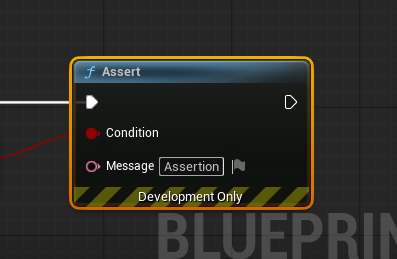
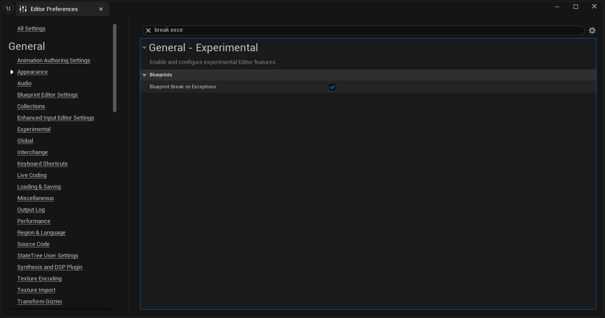

# BlueprintAssertion

UnrealEngine にAssertノードを追加します

作成version: UnrealEngine 5.6.1  
必要に応じてビルドしなおしてください

## usage

1. Plugins以下のファイルをプロジェクトのPlugins以下に設置
2. エディタ設定＞Blueprint Break On Exception を有効にします

